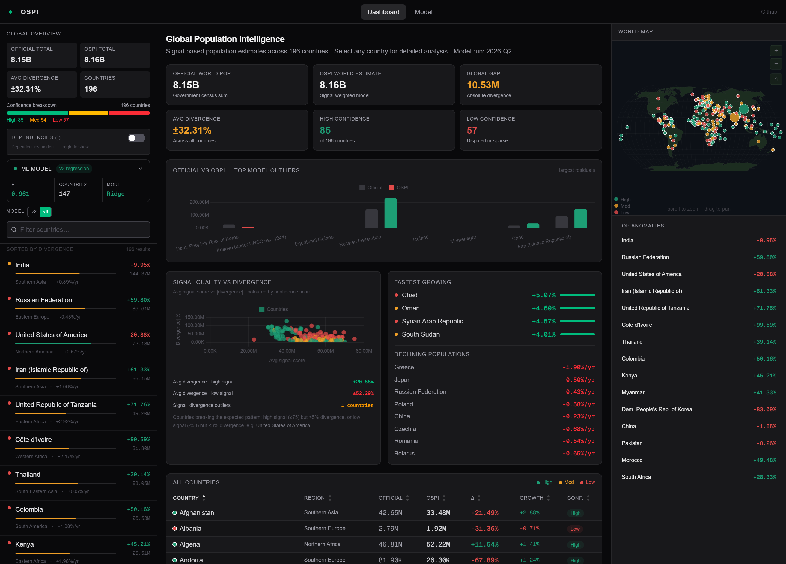
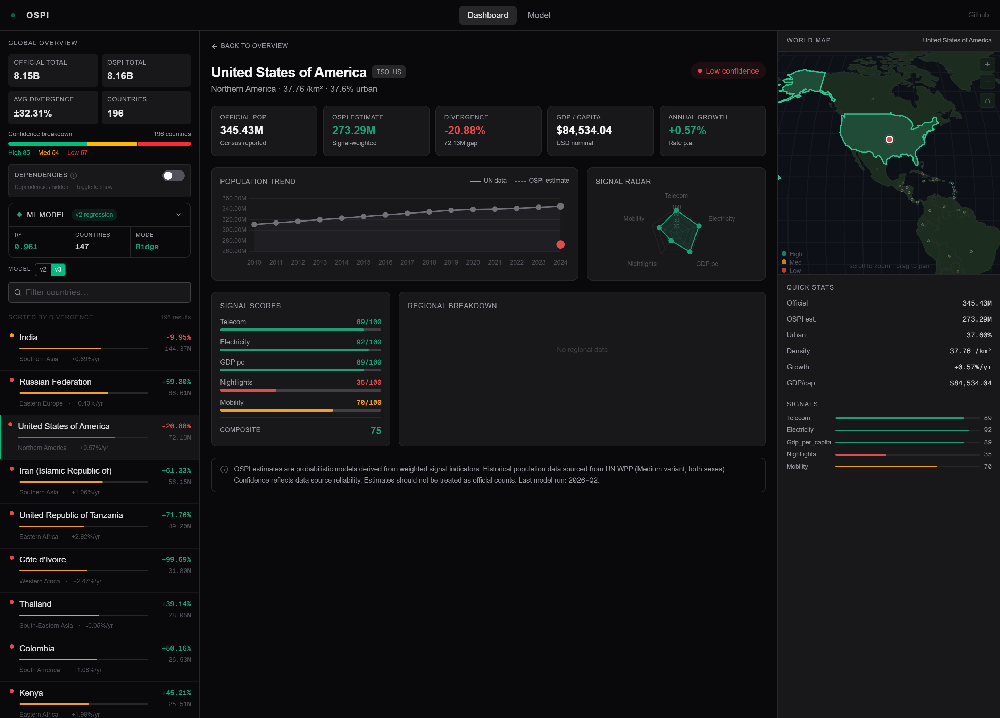

# OpenSignal Population Index (OSPI)

Open-source system for estimating population using infrastructure signals such as telecom activity, electricity consumption, and satellite imagery.

---

## Overview

Official census data is expensive, infrequent, and not always reliable. Methodologies vary and figures can be politically motivated. OSPI addresses this by combining multiple independent infrastructure signals into a Ridge regression model that produces near-real-time population estimates with confidence scoring.

The system is designed to be transparent, reproducible, and deployable against publicly available data. It does not replace census data — it cross-references it.

Two model versions are available and switchable from the sidebar: **v2** (legacy Ridge) and **v3** (population-weighted Ridge). Each version loads its own coefficients, scaler parameters, and signal configuration from the database.

<p align="center">
  
  
</p>

---

## Table of Contents

- [Overview](#overview)
- [Architecture](#architecture)
- [Signals](#signals)
- [Data Sources](#data-sources)
- [Model](#model)
- [Known Limitations](#known-limitations)
- [Version Switching](#version-switching)
- [Stack](#stack)
- [Changelog](#changelog)
- [Contributing](#contributing)
- [License](#license)

---

## Architecture

```
ETL (Python)  →  PostgreSQL  →  FastAPI backend  →  Next.js frontend
```

- **ETL layer** fetches raw signal data per country per year, normalises to log-scale [0, 100] scores, and stores them alongside official UN population figures.
- **Ridge regression model** (two versions: v2 per-feature α, v3 population-weighted RidgeCV) trains on high-confidence UN data. Continent-level bias adjustments are learned from UN sub-region metadata. Five-fold cross-validation produces out-of-fold residuals and CV R² as a guard against overfitting.
- **Estimator** applies the trained model to any country with sufficient signal coverage, returning an estimate, confidence tier (high / med / low), and signal-by-signal breakdown. The model version is selected via query parameter.
- **Frontend** renders an interactive world map with per-country detail panels, trend charts, signal breakdowns, an ML model-status dashboard, a version switcher in the sidebar, and a territory filter to exclude non-sovereign entities.

---

## Signals

Two signal sets exist, one per model version. The **version switcher** in the sidebar toggles between them. The backend returns the correct signal keys for the selected version, and the frontend dynamically renders the coefficient bars and signal breakdown.

### v3 (current)

| Signal | Status |
| ------ | ------ |
| Telecom (mobile subscriptions) | 🟢 Live |
| Electricity consumption | 🟢 Live |
| GDP per capita (log-normalised) | 🟢 Live |
| Nighttime lights (VIIRS DNB) | 🟢 Live |
| Mobility | 🟢 Live |

### v2 (legacy)

| Signal | Status |
| ------ | ------ |
| Telecom (mobile subscriptions) | 🟢 Live |
| Electricity consumption | 🟢 Live |
| Building footprints | 🟢 Live |
| Internet usage | 🟢 Live |
| Mobility | 🟢 Live |

---

## Data Sources

### Population baseline
**UN World Population Prospects (WPP)** via the UN Data Portal API.
Medium variant, 2010–2024. Used as the official baseline all estimates are measured against.

### Signal data

| Signal | Source | Original Indicator | Version |
|--------|--------|--------------------|---------|
| Telecom | World Bank WDI | `IT.CEL.SETS` — total mobile cellular subscriptions | v2 + v3 |
| Electricity | World Bank WDI | `EG.USE.ELEC.KH.PC` × land area (total consumption proxy) | v2 + v3 |
| Internet | World Bank WDI | `IT.NET.BBND` — total fixed broadband subscriptions | v2 only |
| Building | Microsoft Global ML Building Footprints | Total building count per country | v2 only |
| Mobility | Google Community Mobility Reports | Percentage change relative to baseline (2020-02-15) | v2 + v3 |
| GDP per capita | World Bank WDI | `NY.GDP.PCAP.CD` — gross domestic product per capita | v3 only |
| Nighttime lights | EOAtlas / NASA VIIRS | Monthly VIIRS DNB composite radiance averaged per country | v3 only |

### Land area
**World Bank** (`AG.LND.TOTL.K2`) — static land area in km², pulled into `country_metadata` as a size-anchor feature for the model.

### Country metadata
World Bank country list (used to filter valid sovereign states and exclude regional aggregates), supplemented by UN location data for coordinates and sub-region classification.

---

## Model

Two model versions are stored in the database and loaded dynamically based on the selected version. Each version has its own coefficients, scaler parameters, and signal configuration.

### v3 (current)

The v3 model uses a population-weighted Ridge regression with cross-validated regularisation strength (`RidgeCV`). Population weighting (weight ∝ population) prioritises accuracy for larger countries, which dominate the global total — at the cost of higher per-country variance for small nations.

```
log(population)  =  intercept  +  Σ wᵢ · signal_scoreᵢ  +  w_area · log(area_km²)  +  w_continent
```

**Features (6):** telecom, electricity, gdp_per_capita, nightlights, mobility, log_area_km²

`signal_count` was removed in v3 — at inference it was always 5 and added a universal -1.7% penalty.

| Metric | Value |
|--------|-------|
| α (Ridge penalty) | 0.0001 (effectively OLS) |
| In-sample R² | 0.960 |
| 5-fold CV R² | 0.944 |
| Training countries | 147 |
| Global gap | -0.02B |

Most signals receive near-OLS coefficients (α=0.0001). Telecom carries the strongest weight, followed by electricity and mobility.

### v2 (legacy)

The v2 model uses per-feature Ridge regularisation with individual α penalties — strong signals (telecom, land area) are near-OLS, while weak signals (building, mobility, internet) are heavily shrunk toward zero.

```
log(population)  =  intercept  +  Σ wᵢ · signal_scoreᵢ  +  w_area · log(area_km²)  +  w_sig · signal_count  +  Σ w_c · continent_c
```

**Features (7):** telecom, electricity, building, mobility, internet, log_area_km², signal_count

| Feature | α | Role |
|---------|---|------|
| Telecom | 0.001 | Near-OLS — strongest signal (r ≈ 0.98 with log-population) |
| Electricity | 0.1 | Mild shrinkage |
| Building | 10.0 | Heavy shrinkage — effectively pruned |
| Mobility | 10.0 | Heavy shrinkage — effectively pruned |
| Internet | 10.0 | Heavy shrinkage — effectively pruned |
| log(area_km²) | 1e-6 | Effectively unregularised — size anchor |
| signal_count | 0.1 | Mild shrinkage |

| Metric | Value |
|--------|-------|
| In-sample R² | 0.980 |
| 5-fold CV R² | 0.976 |
| Training countries | 148 |

### Continent adjustment

Both versions map UN sub-regions to five continents (Africa, Americas, Asia, Europe, Oceania) with one-hot encoding (Europe dropped as reference). At inference, the estimator looks up the country's UN sub-region, maps it to a continent, and applies the learned bias from `region_coefs` (JSONB in `model_weights`).

### Missing signal imputation

During training, missing signal values are imputed via **k-nearest neighbours** (k=5, distance-weighted). At inference, missing signals fall back to the training-set scaled mean (zero after standardisation).

### Signal normalisation

Raw signal values are log-transformed and min-max scaled to a [0, 100] score per country. The transformation bounds are chosen to span the realistic global range for each indicator:

| Signal | Transformation | Bounds [min, max] |
|---|---|---|
| Telecom | log(IT.CEL.SETS) | [1 000, 2 000 000 000] |
| Electricity | log(kWh × area_km²) | [10 000, 500 000 000 000] |
| Building | log(bld_count × 1 000 000) | [10 000, 500 000 000] |
| Mobility | log(Numbeo score) | [10, 100] |
| Internet | log(IT.NET.BBND) | [10, 1 000 000 000] |

### Confidence tiers

A country's confidence depends on signal coverage and, when available, its out-of-fold residual:

| Coverage | With residual | Without residual |
|---|---|---|
| ≥ 0.8 | `high` if residual < 0.10, else `med` | `high` |
| ≥ 0.6 | `med` if residual < 0.25, else `low` | `med` |
| ≥ 0.4 | `low` | `low` |
| < 0.4 | `low` | `low` |

### Fallback for missing data

Countries with gaps in signal coverage impute missing features using the training-set scaled mean (zero after standardisation, which is equivalent to contributing nothing to the log estimate). On the inference side the same scaler mean is used, so missing signals produce no bias. If all signals are missing, no estimate is returned.

---

## Known Limitations

**World Bank coverage gaps.** WDI does not carry data for Taiwan (`TW`), Palestine (`PS`), and a small number of territories. Taiwan is the most significant omission (~23M people).

**Signal availability varies by year.** Electricity and internet data tend to lag 1–2 years. Countries with fewer than two available signals fall back to a lower confidence tier.

**Building signal (v2 only)** uses the Microsoft Global ML Building Footprints dataset (~200 countries). The raw building count is used directly (not density). Countries with missing, zero, or corrupted footprint data are imputed from land area, urbanisation, and GDP. Removed in v3 (low coverage).

**Mobility signal** switched from Numbeo Traffic Index (v2, 89 countries direct data) to Google Community Mobility Reports (v3, universal coverage).

**Nighttime lights (v3 only)** are sourced from EOAtlas / NASA VIIRS DNB monthly composites. Data gaps exist for some small island nations.

**Population-weighted training (v3)** prioritises large-country accuracy. Average per-country divergence increased from ±29% to ±136% — small countries have higher variance, but the global sum is within -0.02B of the UN total.

**6 countries have no land-area data** from the World Bank (VG, TW, GI, KP, MK, XK). Their `log(area)` falls back to the training-set mean, which reduces prediction accuracy for microstates such as Gibraltar.

**This is not a census replacement.** OSPI estimates are probabilistic. They are most useful for identifying divergence from official figures and tracking demographic trends, not as authoritative population counts.

---

## Version Switching

A **v2 / v3** toggle in the sidebar controls which model version is active across the entire UI. Switching versions triggers a page reload and persists the choice in `localStorage`.

**What changes per version:**

| Element | v2 | v3 |
|---------|----|----|
| Model (coefficients, intercept) | Model 14 (OLS, R²=0.980, 148 countries) | Model 21 (Ridge α=0.0001, R²=0.960, 147 countries) |
| Signals | telecom, electricity, building, internet, mobility + log_area + signal_count | telecom, electricity, gdp_per_capita, nightlights, mobility + log_area |
| Scaler | 7-element mean | 6-element mean |
| Confidence tiers | Coverage ≥ 0.4 threshold | Coverage ≥ 0.2 threshold |

The backend returns model coefficients and signal keys matching the selected version.

---

## Stack

- **Backend:** Python, FastAPI, PostgreSQL, psycopg2, scikit-learn, httpx
- **ETL:** World Bank API (WDI), UN Data Portal API, Google Community Mobility Reports, EOAtlas / NASA VIIRS
- **Frontend:** Next.js, TypeScript, Chart.js, D3, Tailwind CSS
- **Deployment:** Vercel (frontend + backend serverless)

---

## Changelog

See [CHANGELOG](CHANGELOG.md) for a detailed version history.

---

## Contributing

Contributions are welcome. See [CONTRIBUTING](CONTRIBUTING.md) for setup, guidelines, and PR process.

---

## License

Apache License 2.0 — see [LICENSE](LICENSE) for details.
